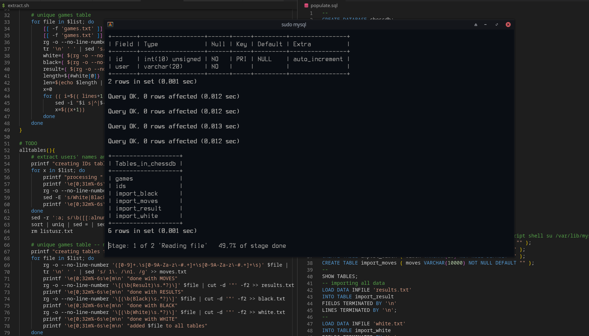

# chessdb
`chessdb` is MySQL database storing all games and its relative information taken from https://database.nikonoel.fr/  
More about setting/up the DB [here](configuration.md)  
On the [logical model](db_model.md)
## Images
[comment]: <> (TODO finish queries)
